# Cloudflare Zero Trust & GCP Edge Architecture

**Cloudflare Solutions Engineer — Technical Assignment**
Domain: [`eshwar.tech`](https://eshwar.tech) · Public app: `tunnel.eshwar.tech`

This repository documents the migration of an application hosted on Google Cloud Platform (GCP) from a legacy, public-facing perimeter to a Zero Trust architecture backed by Cloudflare — including the Worker source (`index.js`) and config (`wrangler.toml`) used to serve identity-aware, edge-rendered content from a private R2 bucket.

## Table of Contents

- [Overview](#overview)
- [Technical Specifications](#technical-specifications)
- [Phase 1 — Domain Onboarding](#phase-1--domain-onboarding)
- [Phase 2 — Legacy Baseline (Public Origin & Full-Strict TLS)](#phase-2--legacy-baseline-setup-public-origin--full-strict-tls)
- [Phase 3 — Edge Rate Limiting](#phase-3--edge-rate-limiting-enforcement)
- [Phase 4 — Zero Trust Pivot (Cloud NAT, Tunnel & Lockdown)](#phase-4--zero-trust-pivot-cloud-nat-tunnel--origin-lockdown)
- [Phase 5 — Access & GitHub SSO](#phase-5--cloudflare-access--dual-rule-github-sso)
- [Phase 6 — Worker & Private R2](#phase-6--serverless-edge-worker--private-r2-integration)
- [Submission Artifact Index](#submission-artifact-index)

---

## Overview

The migration transitions the infrastructure through two states:

1. **Act 1 (Legacy Baseline):** an origin VM exposed directly to the public internet via an External IP, proxying through Cloudflare with Full (Strict) TLS and rate limiting.
2. **Act 2 (Zero Trust Target):** complete origin lockdown. The VM's public IP is removed, inbound web ports (80/443) are closed, and outbound connectivity is maintained via Cloud NAT. Ingress traffic to the application is restricted exclusively to authenticated requests passing through Cloudflare Access, Cloudflare Tunnel, and Cloudflare Workers.

---

## Technical Specifications

| Component | Detail |
|---|---|
| Domain & Routing | `eshwar.tech` · Public hostname `tunnel.eshwar.tech` |
| GCP Infrastructure | `e2-micro` (`us-central1-a`, Always Free compute tier), Debian/Ubuntu, Node.js/Express origin on port 80 |
| GCP Egress Network | Private subnet (`default`), Cloud Router `nat-router` & Cloud NAT `nat-config` (`us-central1`) |
| Edge Stack | Cloudflare Worker `cf-demo` · Private R2 bucket `country-flags` |
| Identity | Cloudflare Access + GitHub OAuth 2.0 · Access app "Cloudflare Zero Trust Access" · Policy "Allow-Self-GitHub-And-Cloudflare" |

---

## Phase 1 — Domain Onboarding

1. Domain onboarded to Cloudflare (Free plan).
2. Nameservers updated to Cloudflare's authoritative NS records at the registrar.

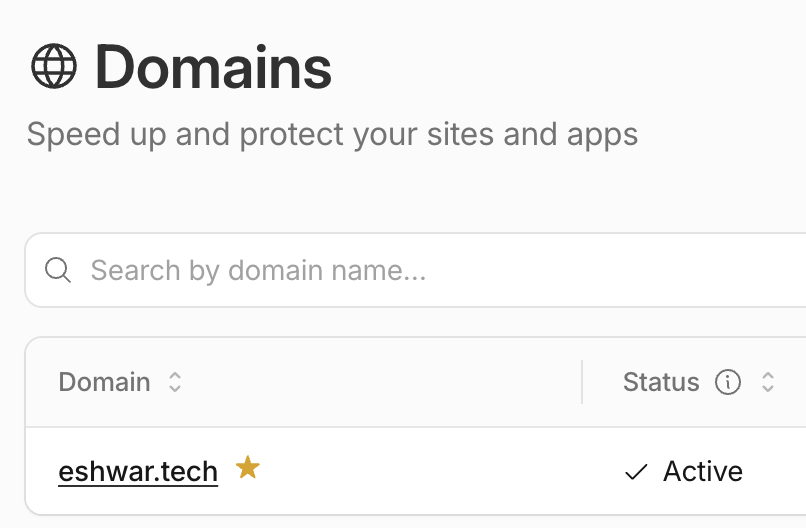

---

## Phase 2 — Legacy Baseline Setup (Public Origin & Full-Strict TLS)

*This phase establishes the baseline state prior to executing origin lockdown.*

1. Provisioned `origin-vm` (`e2-micro`, `us-central1-a`) with an automatically allocated external IP.
2. Deployed an Express app returning request headers as JSON, listening on port 80.
3. Created DNS A record `www.eshwar.tech` → `<VM_EXTERNAL_IP>` (Proxied).
4. Issued a Let's Encrypt TLS certificate on the origin, bound to port 443.
5. Set Cloudflare SSL/TLS mode to **Full (Strict)**.


> This is the "legacy perimeter" state: the origin is reachable directly if someone discovers its IP, bypassing Cloudflare's WAF and rate limiting entirely. This is the flaw Phase 4 fixes.

---

## Phase 3 — Edge Rate Limiting Enforcement

1. Configured a Cloudflare WAF rate limiting rule: 5 requests / 10 seconds per IP → Block for 10 seconds.
2. Validated with a burst test:
   ```bash
   for i in {1..10}; do curl -s -o /dev/null -w "%{http_code}\n" https://www.eshwar.tech; done
   ```

| Burst result | Rule configuration |
|---|---|
| 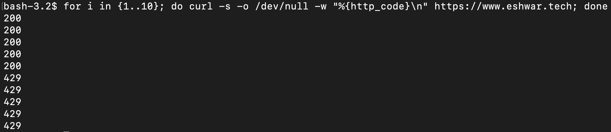 | 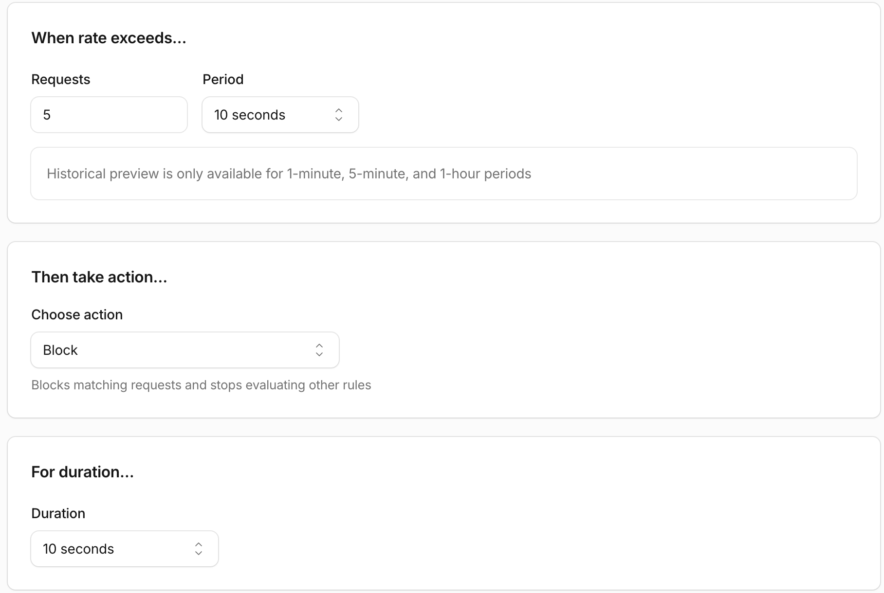 |

---

## Phase 4 — Zero Trust Pivot (Cloud NAT, Tunnel & Origin Lockdown)

### Step 1: Administrative Access

Administrative SSH access to `origin-vm` is maintained through the GCP Console's built-in SSH-in-browser client, which continues to function after the VM's external IP is removed.

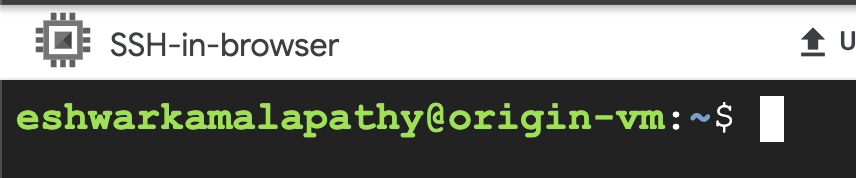

### Step 2: Provision Cloud NAT Egress Pipeline

Private VMs without public IPs cannot reach external endpoints (including Cloudflare's edge connectors) using Private Google Access alone. A regional Cloud NAT was provisioned:

```bash
gcloud compute routers create nat-router --network=default --region=us-central1

gcloud compute routers nats create nat-config \
    --router=nat-router --region=us-central1 \
    --auto-allocate-nat-external-ips --nat-all-subnet-ip-ranges
```

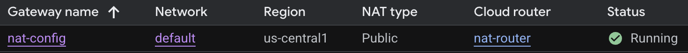

### Step 3: Deploy Cloudflare Tunnel

1. Created tunnel `origin-tunnel` in Zero Trust Dashboard → Networks → Tunnels.
2. Installed the connector on the VM: `cloudflared service install <TOKEN>`.
3. Mapped public route: `tunnel.eshwar.tech` → `http://localhost:80`.

| Tunnel health | Public route |
|---|---|
| 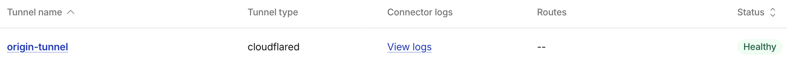 | 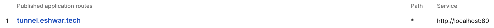 |

### Step 4: Execute Origin Lockdown

1. Set `origin-vm` external IP to **None**.
2. Removed ingress HTTP (80) / HTTPS (443) firewall rules.
3. Restarted the tunnel daemon over Cloud NAT.

| Direct-IP access (blocked) | Tunnel access (still works) |
|---|---|
| 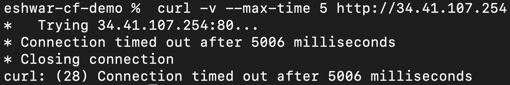 |  |

> Origin now has zero open inbound ports and zero public IP. The only way in is through Cloudflare's edge.

---

## Phase 5 — Cloudflare Access & Dual-Rule GitHub SSO

1. Registered a GitHub OAuth App ("Cloudflare Zero Trust Access"): homepage `https://tunnel.eshwar.tech`, redirect URI `https://long-thunder-ffde.cloudflareaccess.com/cdn-cgi/access/callback`.
2. Added GitHub as an Identity Provider in the Zero Trust Dashboard.
3. Created a Self-Hosted Access Application scoped to `tunnel.eshwar.tech`, path `secure*`.
4. Configured policy "Allow-Self-GitHub-And-Cloudflare" with two Include rules (OR'd):
   - Emails → `eshwarkamalapathy@gmail.com`
   - Emails ending in → `cloudflare.com`

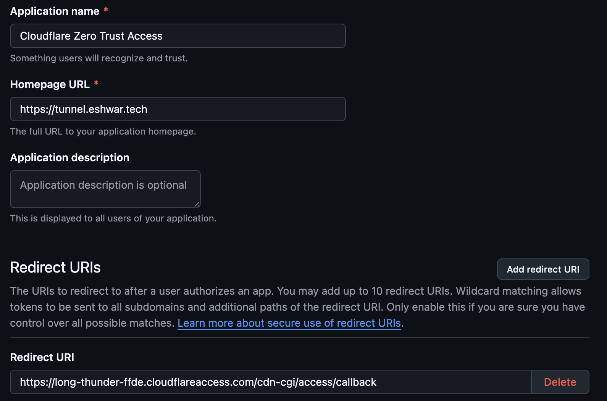

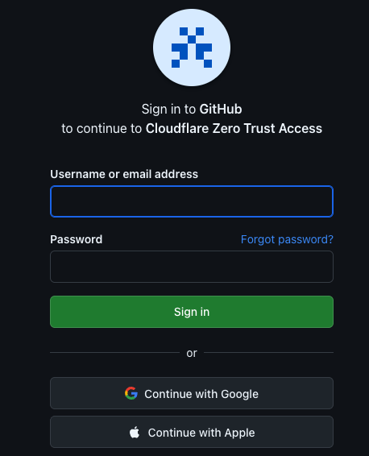

<details>
<summary>Supplementary: Access-injected identity headers post-login</summary>

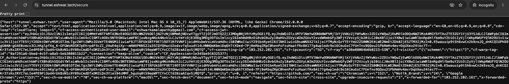

Raw request headers observed via the origin's echo endpoint, showing Cloudflare Access's injected `cf-access-authenticated-user-email` and JWT assertion — the header the Worker reads to build the identity payload below.
</details>

| Access policy (dual rule) | Unauthorized user denied |
|---|---|
| 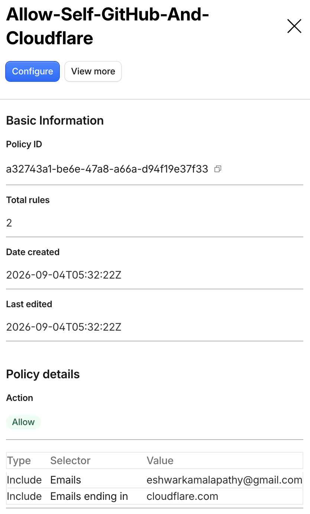 | 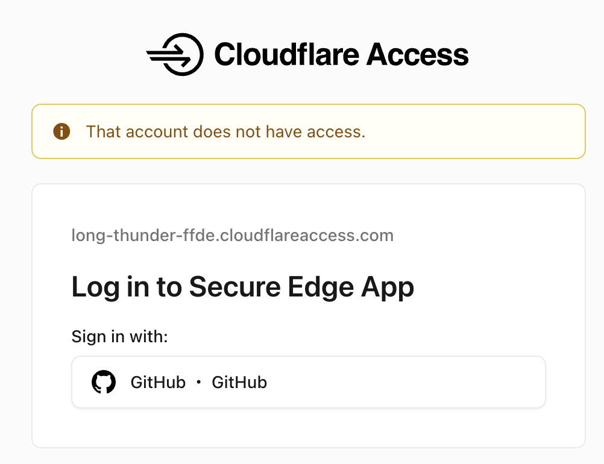 |

---

## Phase 6 — Serverless Edge Worker & Private R2 Integration

1. Created private R2 bucket `country-flags` (no custom domain, Public Development URL disabled).
2. Uploaded flag assets via Wrangler CLI:
   ```bash
   wrangler r2 object put country-flags/SG.png --file=./SG.png --content-type=image/png
   ```
3. **`wrangler.toml`:**
   ```toml
   name = "cf-demo"
   main = "src/index.js"
   compatibility_date = "2024-01-01"

   # Intercept traffic for tunnel.eshwar.tech/secure*
   routes = [
     { pattern = "tunnel.eshwar.tech/secure*", zone_name = "eshwar.tech" }
   ]

   # Bind private R2 bucket to the worker runtime
   [[r2_buckets]]
   binding = 'FLAGS_BUCKET'
   bucket_name = 'country-flags'
   ```
   > Route binding is declared directly in `wrangler.toml` rather than attached manually via the dashboard — the route ships as part of the Worker's config-as-code.

4. **`src/index.js`:**
   ```javascript
   export default {
     async fetch(request, env, ctx) {
       const url = new URL(request.url);
       const pathname = url.pathname;

       // Extract identity assertions injected by Cloudflare Access
       const email = request.headers.get("cf-access-authenticated-user-email") || "Authenticated User";
       const rawCountry = request.cf?.country || "US";
       const country = rawCountry.toUpperCase();
       const timestamp = new Date().toISOString();

       // -------------------------------------------------------------
       // Requirement 8c: /secure/${COUNTRY} -> Return Flag Image from R2
       // -------------------------------------------------------------
       const countryMatch = pathname.match(/^\/secure\/([A-Za-z]{2})$/i);
       if (countryMatch) {
         const requestedCountry = countryMatch[1].toUpperCase();
         const objectKey = `${requestedCountry}.png`;

         // Fetch flag object from private R2 bucket
         const object = await env.FLAGS_BUCKET.get(objectKey);

         if (!object) {
           return new Response(`Flag asset '${objectKey}' not found in R2 bucket`, {
             status: 404,
             headers: { "content-type": "text/plain" }
           });
         }

         const headers = new Headers();
         object.writeHttpMetadata(headers);
         headers.set("content-type", "image/png");

         // Optimization: Cache flag assets at the Edge and Browser for 24 hours
         headers.set("cache-control", "public, max-age=86400, s-maxage=86400");

         return new Response(object.body, { headers });
       }

       // -------------------------------------------------------------
       // Requirement 8b: /secure -> Return HTML Identity Info Response
       // -------------------------------------------------------------
       if (pathname === "/secure" || pathname === "/secure/") {
         const htmlContent = `<!DOCTYPE html>
   <html lang="en">
   <head>
       <meta charset="UTF-8">
       <title>Zero Trust Identity Check</title>
       <style>
         body { font-family: system-ui, -apple-system, sans-serif; padding: 2rem; background: #f4f4f5; color: #18181b; }
         .card { background: white; padding: 2rem; border-radius: 8px; box-shadow: 0 4px 6px -1px rgba(0,0,0,0.1); max-width: 600px; margin: 0 auto; }
         a { color: #2563eb; font-weight: 600; text-decoration: none; }
         a:hover { text-decoration: underline; }
         code { background: #e4e4e7; padding: 0.2rem 0.4rem; border-radius: 4px; font-size: 0.9em; }
       </style>
   </head>
   <body>
       <div class="card">
           <h2>Zero Trust Identity Payload</h2>
           <p>
               <strong>${email}</strong> authenticated at
               <code>${timestamp}</code> from
               <a href="/secure/${country}">${country}</a>
           </p>
       </div>
   </body>
   </html>`;

         return new Response(htmlContent, {
           headers: {
             "content-type": "text/html;charset=UTF-8",
           },
         });
       }

       return new Response("Not Found", { status: 404 });
     },
   };
   ```

5. Deployed via Wrangler CLI (`npx wrangler deploy`); route bound via `wrangler.toml`, not the dashboard.

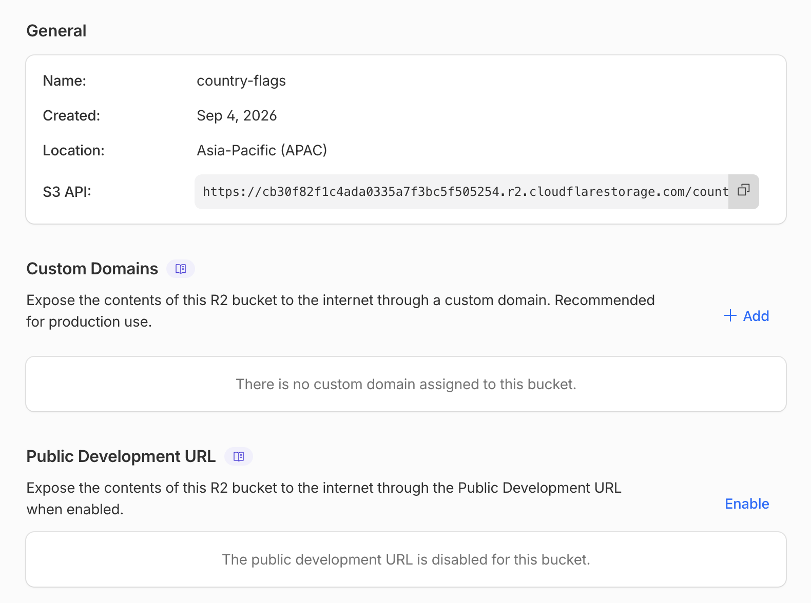

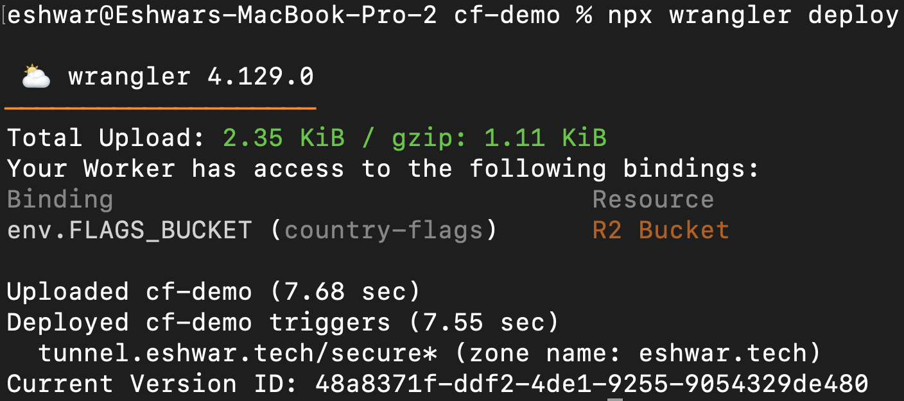

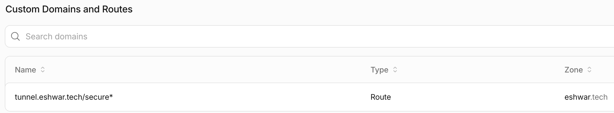

| Identity payload (`/secure`) | Flag asset (`/secure/SG`) |
|---|---|
| 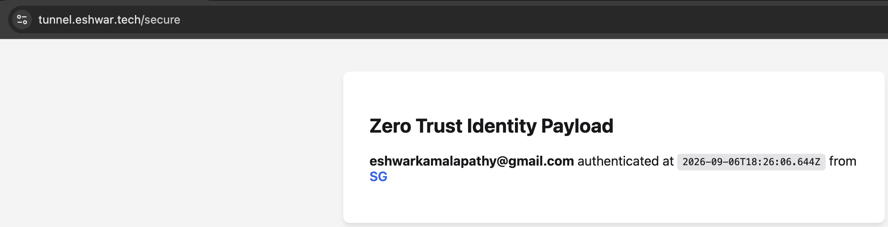 |  |

| `/secure` → `text/html` | `/secure/SG` → `image/png` |
|---|---|
| 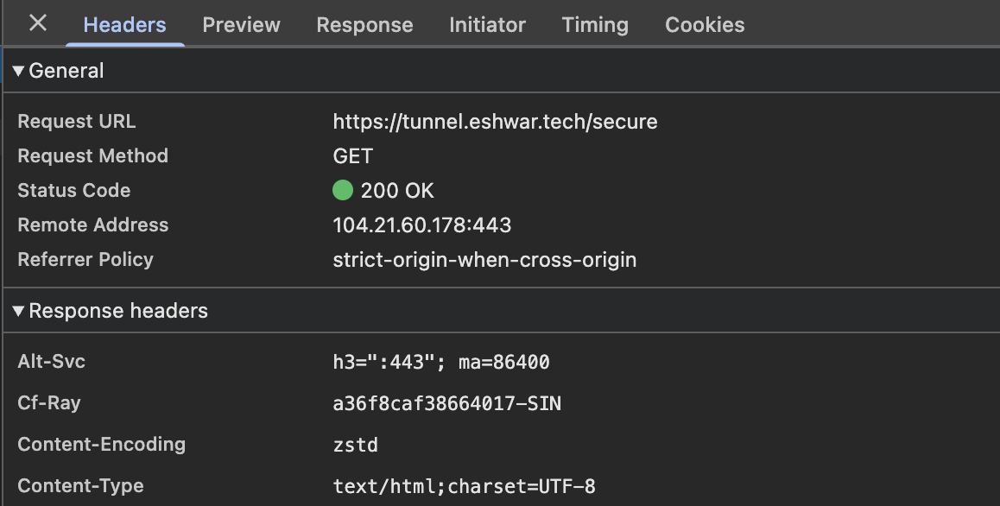 | 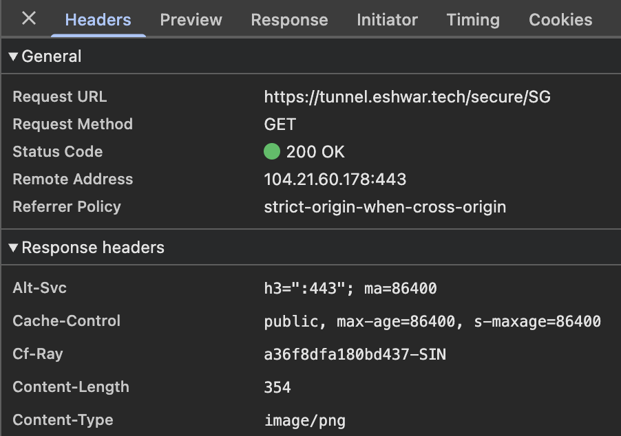 |

---

## Submission Artifact Index

| # | Artifact | Evidence / Architectural Proof |
|---|---|---|
| 01 | `01_active_domain.png` | Active DNS zone in Cloudflare |
| 02 | `02_tls_strict_curl.jpg` | Act 1 baseline: Full (Strict) TLS on public origin |
| 03a | `03a_rate_limit_burst.png` | Rate limit burst: 200 → 429 |
| 03b | `03b_rate_limit_rule_config.png` | Rate limit rule configuration |
| 04a | `04a_iap_ssh_verified.png` | Admin access preserved via GCP Console SSH |
| 04b | `04b_gcp_cloud_nat.png` | Cloud NAT gateway operational |
| 04c | `04c_tunnel_healthy.png` | Cloudflare Tunnel Healthy |
| 04d | `04d_tunnel_public_app_route.png` | Public route → `localhost:80` |
| 05 | `05_tunnel_curl_success.jpg` | Tunnel reachable post-lockdown |
| 06a | `06a_origin_lockdown.png` | Direct-IP connection times out (core pivot proof) |
| 06b | `06b_github_oauth_app.png` | GitHub OAuth app registration |
| 06c | `06c_access_login_gate.png` | GitHub SSO challenge intercepting `/secure` |
| 07a | `07a_access_sso_success.png` | Access-injected identity headers post-login (supplementary) |
| 07b | `07b_access_policy_config.png` | Dual-rule policy: email AND `@cloudflare.com` |
| 07c | `07c_access_denied_test.png` | Unauthorized user denied |
| 08a | `08a_r2_private_settings.png` | R2 bucket `country-flags` is private |
| 08b | `08b_wrangler_deploy_output.png` | Worker deployed via Wrangler CLI |
| 09 | `09_worker_route.png` | Route bound to `tunnel.eshwar.tech/secure*` |
| 10 | `10_secure_identity_payload.png` | Identity payload renders correctly |
| 11 | `11_worker_r2_flag_display.png` | Flag asset served from private R2 |
| 12a | `12a_content_type_html.png` | `/secure` returns `text/html` |
| 12b | `12b_content_type_image.png` | `/secure/SG` returns `image/png` |
| 13 | `13_public_github_repo.png` | Public repo of Worker code (this repository) |

All artifacts complete. ✅
